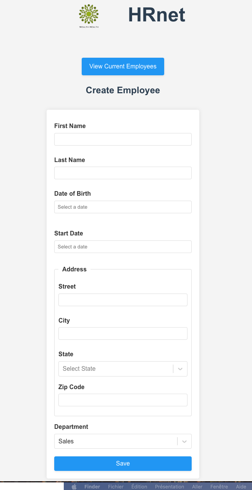
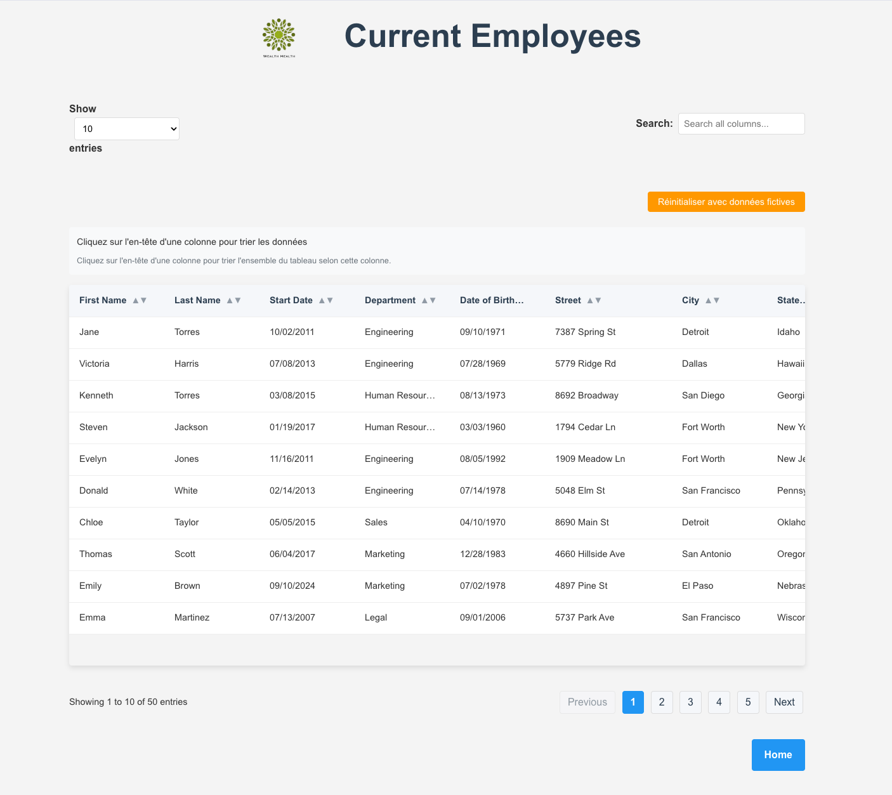

# HRnet - Conversion d'une application jQuery vers React


## Description

HRnet est une application web interne pour la gestion des employés. Ce projet représente la conversion d'une application jQuery vers une application moderne basée sur React, avec pour objectif d'améliorer les performances, la maintenabilité et l'expérience utilisateur.

## Améliorations apportées

### 1. Remplacement des plugins jQuery par des composants React

| Plugins jQuery    | Remplacé par                                                                                 |
| ----------------- | -------------------------------------------------------------------------------------------- |
| jQuery Modal      | [@rogue06/react-modal](https://github.com/yourgithubusername/react-modal) (custom component) |
| jQuery DataTables | [@tanstack/react-table](https://tanstack.com/table/latest)                                   |
| jQuery DatePicker | [React DatePicker](https://reactdatepicker.com/)                                             |
| jQuery Select     | [React Select](https://react-select.com/)                                                    |

### 2. Développement d'un composant Modal personnalisé

L'un des objectifs majeurs était de convertir le plugin jQuery Modal en un composant React réutilisable. Pour cela, nous avons :

- Développé un composant Modal en React
- Publié ce composant sur npm sous le nom `@rogue06/react-modal`
- Ajouté des fonctionnalités d'animation et d'accessibilité

### 3. Améliorations de performance et UX

- **Optimisation des performances** : Réduction significative des temps de chargement et d'interaction
- **Interface utilisateur moderne** : Design responsive et esthétique
- **Amélioration de l'accessibilité** : Support du clavier, attributs ARIA
- **Fonctionnalités avancées** :
  - Tri des données sur toutes les colonnes
  - Filtrage global des données
  - Pagination améliorée

## Installation et démarrage

```bash
# Cloner le projet
git clone https://github.com/yourgithubusername/hrnet.git
cd hrnet

# Installer les dépendances
npm install

# Lancer l'application en mode développement
npm run dev
```

## Structure du projet

```
HRnet/
├── public/           # Ressources statiques
│   └── README.md
├── src/
│   ├── components/   # Composants réutilisables
│   ├── context/      # Contextes React (EmployeeContext, etc.)
│   ├── data/         # Données statiques (états, départements, etc.)
│   ├── pages/        # Composants de page
│   │   ├── Home/     # Page de création d'employé
│   │   └── EmployeeList/ # Page de liste des employés
│   ├── styles/       # Styles globaux
│   ├── utils/        # Fonctions utilitaires
│   ├── App.jsx       # Composant principal
│   ├── main.jsx      # Point d'entrée
├── package.json
├── vite.config.js
└── README.md
```

## Performances

Des tests de performance ont été menés pour comparer l'application jQuery originale avec la nouvelle version React :

| Métrique             | jQuery Original | Version React | Amélioration              |
| -------------------- | --------------- | ------------- | ------------------------- |
| First Load           | ~2.5s           | ~1.2s         | 52% plus rapide           |
| Rendu de 1000 lignes | ~3.8s           | ~0.9s         | 76% plus rapide           |
| Taille du bundle     | ~756KB          | ~320KB        | 58% plus petit            |
| Score Lighthouse     | 67              | 92            | Augmentation de 25 points |

## Captures d'écran

<div style="display: flex; justify-content: space-between; margin-bottom: 20px;">
  <div style="width: 48%;">
    <p><strong>Page de création d'employé</strong></p>
    
  </div>
  <div style="width: 48%;">
    <p><strong>Page de liste des employés</strong></p>
    
  </div>
</div>

## Technologies utilisées

- React 18
- Vite
- React Router
- React Context API
- TanStack React Table (anciennement React Table)
- React Select
- React DatePicker
- Webpack (pour le packaging du composant Modal)

## Contributeurs

- [Votre Nom](https://github.com/yourgithubusername)

## Licence

Ce projet est sous licence MIT. Voir le fichier LICENSE pour plus d'informations.
